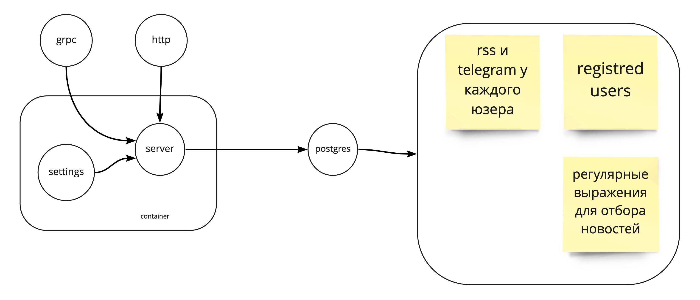

# homework-2

# Бот-новостная рассылка

[//]: # (Бот позволяет агрегировать информацию из нескольких источников &#40;минимум 2&#41;, типа RSS и Telegram каналы, после чего формирует единую новостную ленту для пользователя.)
[//]: # (Необходимые возможности:)
[//]: # (Регистрация в боте)
[//]: # (Добавление новых источников)
[//]: # (Подкписка и отписка пользователя от источников)
[//]: # (Поиск новостей по заданным ключевым словам &#40;по регуляркам&#41;)

# Возможные операции

1. Юзер может добавить канал в новостную подборку по ссылке на rss или telegram канал
2. Юзер может установить регулярное выражение для фильтрации новостей
3. Юзер может удалить канал из подборки
* Возможно стоит добавить регистрацию, для того чтобы иметь одну и тужу подборку с разных аккаунтов 

---

# Использование

1. Юзер добавляет себе бота
2. Потом устанавливает в нем каналы которые его интересуют
3. Получает от нашего бота подборку новостей от этих каналов, подборка может быть фильтрованая

---

# Требоавния

1. ~~Сервис должен предоставлять gRPC интерфейс~~
2. ~~Сервис должен предоставлять HTTP интерфейс как прокси к gRPC интерфейсу (через grpc-gateway).~~
3. ~~Интерфейс бота, используемый в мессенджере, должен быть продублирован через gRPC/HTTP ручки.~~
4. ~~Сервис должен использовать миграции при работе с БД~~
5. ~~С сервисом можно взаимодействовать через интерфейс какого-либо мессенджера (в приоритете Mattermost и Telegram)~~
6. Сервис должен хранить конфигурацию в yaml файлах
7. ~~Сервис должен быть завёрнут в докер.~~